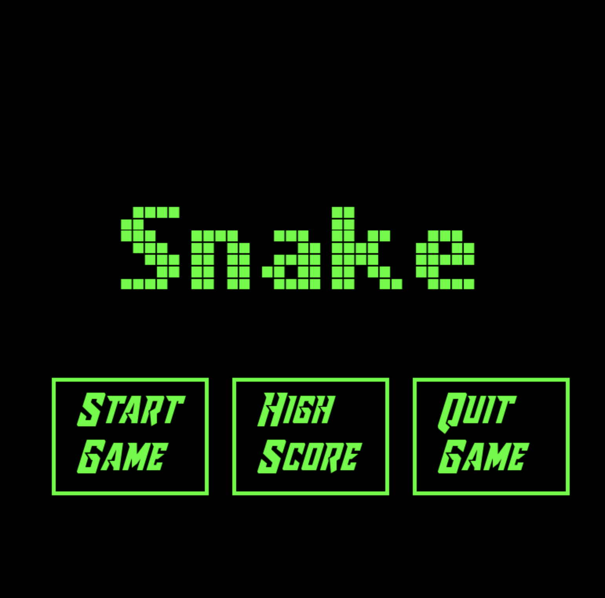

# Snake Game
## CS110 Final Project  Spring Semester, 2024

## Team Members

Luis Muench

***

## Project Description

Snake arcade game controlled by arrow keys where the snake can turn up, right, down, and left. You eat apples which make the snake longer and if you hit the edge or the body of the snake the game ends.

***    

## GUI Design

### Final Design

## Program Design

### Features

1. Interactive Menu
2. High Score Screen
3. Moving snake
4. Snake eating apple
5. End screen after collision

### Classes

1. Controller Class
- Contains the pygame data in the init as well as the mainloop which switches the game between the four other loops which are each a different screen, the menuloop, the scoreloop, the gameloop, and the endloop.
2. Snake Class
- The snake class is in the model file and contains the data for the snake character and has functions to update its position as well as change its direction
3. Apple Class
- The apple is also in the model file and contains the coordinates for the apple that are used to create its rectangle and draw it
4. Score Class
- Score class is in the score.py file in src and has two functions, one reads out the highest score from the score txt file in the etc folder and the other updates the score txt file with the newest score after each game ends

## ATP

### Test 1 - Game Start
- Step 1: Run program
    - Open terminal, go to project folder, type:
         - python3 main.py
 - Step 2: Click "Start Game" button
 - **Expected Outcome:**
    - Game starts with unmoving snake appearing as a green square and apple in a random location appearing as a red square
### Test 2 - Move snake
- Step 1: Start Game
- Step 2: Hit up, right, down, and left arrow keys
- **Expected Outcome**
    - Snake begins moving after hitting first arrow key and turns whenever another is pressed, except when trying to turn 90 degrees in the opposite direction
### Test 3 - Eat Apple
- Step 1: Start Game 
- Step 2: Move snake head into apple 
- **Expected Outcome**
    - Once snake moves into apple the apple will disappear and reappear in another location while the snake gains two blocks of length. The score text in the top left should increase by 2 each time an apple has been eaten.
### Test 4 - Collision/Death
- Step 1: Start Game
- Step 2: Move snake into edge of screen or eat a few apples and collide snake head into snake body
- **Expected Outcome**
    - Once the snake collides with the edge of the screen or
 with its body a screen will pop up saying "Game Over" and share your final score. There will be a button labeled "Menu" that will bring you back to the main menu once clicked
### Test 5 - High Score
- Step 1: Play 2-3 times
- Step 2: Go to main menu screen
- Step 3: Click on "High Score" button
- **Expected Outcome**
    - After clicking the High Score button the screen should read "The High Score is " followed by the highest score you've reached. There should be a menu button below this that once clicked returns you to the main menu
